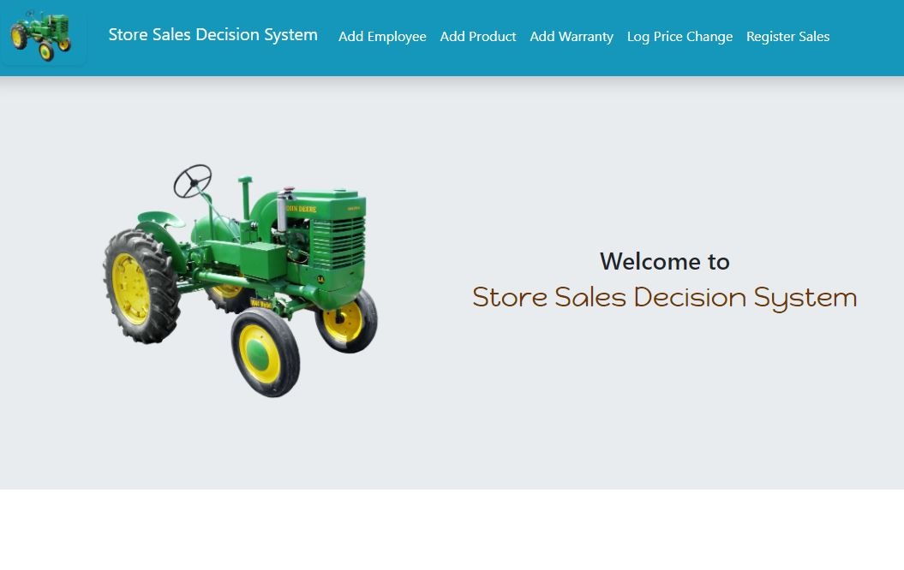

# Store Sales Decision System - Capstone 1

## Description

Store Sales Decision System is an application built around Python (FLASK and SQLAlchemy frameworks), Pandas, MySQL that allows TraktorTEK to enter sales data. It also allows the end user to add new sales team leader, products, warranties for products, and log price changes.

## Table of Contents

* [Usage](#usage)
* [Installation](#installation)
* [Where to Contribute](#where-to-contribute)
* [Repository](#repository)
* [Questions](#questions)
* [Screenshot](#screenshot)

## Usage

This Python application allows the user to navigate into Store Sales Decision System with the following features:

* Register weekly sales data
* Add new sales team leaders
* Add new products and warranties
* Log price changes for products

## Installation

Clone the repository using Git.

    git clone git@github.com:ivanzapatarivera/Mid_Capstone_Store_Sales_Decision_System.git

Create config.py with the following variables that run on your MySQL Workbench.

    username = 'root'
    password = 'password'
    port = 3306
    server = 'localhost'
    hostname = '127.0.0.1'
    database = 'database'
    auth_plugin='mysql_native_password'
    db_uri = f'mysql://{username}:{password}@{server}/{database}'

Using CLI (conda environment activated from Anaconda is required), run:

    On Mac OS:

        First time only: 
            set FLASK_APP=main.py 
            set FLASK_ENV=development
        
        Afterwards:
            python main.py
            start chrome http://127.0.0.1:5000/
    
    On Windows:

        First time only:
            export FLASK_APP=main.py
            export FLASK_ENV=development
        
        Afterwards:
            python main.py
            start chrome http://127.0.0.1:5000/

To load your first batch of data stored in current directory run the following command on CLI (Mach OS and Windows):

    python batch.py

## Where to Contribute

Contribution requests may be sent to:

* Email: [ivan.zapata-rivera@gmail.com](mailto:ivan.zapata-rivera@gmail.com)
* LinkedIn: [Ivan J. Zapata-Rivera: linkedin.com/in/ivanzapatarivera/](https://www.linkedin.com/in/ivanzapatarivera/)

## Repository

GitHub Title: [Mid_Capstone_Store_Sales_Decision_System: https://github.com/ivanzapatarivera/Mid_Capstone_Store_Sales_Decision_System](https://github.com/ivanzapatarivera/Mid_Capstone_Store_Sales_Decision_System)

## Screenshot

